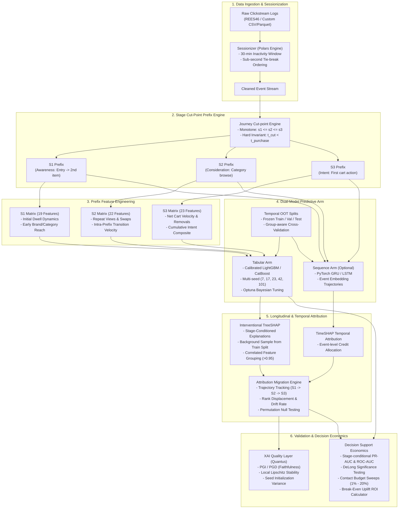

# Funnel-Stage SHAP: Dynamic Explainable AI for Sequential Consumer Journeys

[](https://www.python.org/downloads/release/python-3110/)
[](https://opensource.org/licenses/MIT)
[](tests/)
[](https://github.com/astral-sh/ruff)
[](https://github.com/pypa/hatch)
[](https://typer.tiangolo.com/)

**Funnel-Stage SHAP** is a high-performance, developer-ready Python framework for **dynamic, stage-conditioned sequential purchase prediction and longitudinal explainability (XAI)** in digital consumer journeys.

Traditional Explainable AI (XAI) models in e-commerce evaluate consumer behavior post-hoc over full sessions. This introduces severe **hindsight leakage** and **temporal flattening**, obscuring how purchase drivers emerge, dominate, and decay across the decision funnel. **Funnel-Stage SHAP** resolves this by enforcing **strict prefix anti-leakage invariants**, training stage-conditioned models on nested event prefixes, tracking **longitudinal attribution migration** across stages, and validating explanations via multi-dimensional axiomatic quality metrics.

---

## Architecture Overview

Funnel-Stage SHAP is engineered around a modular, 6-layer decoupled pipeline designed for enterprise production scale and mathematical rigor.



### Layer Deep-Dive

1. **Sessionization & Deduplication (`funnel_shap.data.sessionize`):**
   Powered by Polars for lightning-fast memory-mapped processing. Automatically handles sub-second timestamp collisions using deterministic file-order tie-breaking, applies configurable inactivity cutoffs (default: 30 minutes), and filters bot traffic.

2. **Stage Cut-Point Prefix Engine (`funnel_shap.data.journey`):**
   Partitions consumer sessions into granular, behavioral funnel stages:
   * **Stage 1 ($S_1$)**: *Awareness* — Session entry to initial catalogue contact (cut-point: second product interaction).
   * **Stage 2 ($S_2$)**: *Consideration* — Product and category exploration (cut-point: repeat view or category switch).
   * **Stage 3 ($S_3$)**: *Cart Intent* — Purchase intent emergence (cut-point: first cart addition).
   * **Stage 4 ($S_4$)**: *Conversion Window* — The purchase event itself (used solely as the predictive label; never included in features).
   * **Zero Leakage Guarantees:** Guarantees $s_1 \le s_2 \le s_3 < t_{\text{purchase}}$ for all sessions. Pre-purchase prefixes are strictly nested: $\mathcal{E}_1 \subseteq \mathcal{E}_2 \subseteq \mathcal{E}_3$.

3. **Prefix Feature Engineering (`funnel_shap.features.prefix_features`):**
   Aggregates prefix events into fixed-dimensional vectors without looking ahead:
   * **Conservative Dwell Time:** Dwell is computed strictly between consecutive intra-prefix events. The final event of a prefix contributes zero dwell to avoid leaking time to future actions beyond the cut-point.
   * **Dynamic Behavioral Metrics:** Computes transition velocity, unique category ratios, search revisitation, net cart additions, and domain-grounded intent composites.

4. **Dual-Model Predictive Arm (`funnel_shap.models`):**
   * **Tabular Models:** Production-grade LightGBM, CatBoost, XGBoost, and Logistic Regression baselines with Platt scaling and isotonic probability calibration.
   * **Sequence Models:** PyTorch Recurrent (GRU/LSTM) architectures processing tokenized event streams up to the stage cut-point.
   * **Multi-Seed Stability:** Enforces multi-run evaluations across frozen seeds $\{7, 17, 23, 42, 101\}$ with bootstrapped 95% confidence intervals.

5. **Attribution Migration & Longitudinal XAI (`funnel_shap.explain`):**
   * **Interventional TreeSHAP:** Employs an interventional feature perturbation background drawn strictly from the training split to break spurious correlations.
   * **Feature Grouping:** Hierarchically clusters redundant features with $|\rho| \ge 0.95$ (critical at $S_1$ where short prefixes cause collinearity).
   * **Attribution Migration Trajectories:** Quantifies how feature importance migrates dynamically from discovery factors (dwell, broad categories) to transaction determinants (cart velocity, price sensitivity).

6. **Explanation Quality & Decision Support (`funnel_shap.explain.quality`, `funnel_shap.evaluate`):**
   * **Axiomatic Faithfulness:** Validates explanation fidelity via Prediction Gap on Insertion (PGI) and Prediction Gap on Deletion (PGD).
   * **Lipschitz Stability:** Assesses explanation invariance under infinitesimal input perturbations that leave model predictions unchanged.
   * **Decision Economics:** Computes incremental precision curves over budget-constrained contact policies (1% to 20% targeting thresholds) and evaluates break-even intervention uplift.

---

## Installation

### Prerequisites
* Python `3.11` (strictly enforced for exact numerical reproducibility).
* Fast package installation via [`uv`](https://github.com/astral-sh/uv) (recommended) or standard `pip`.

### 1. Basic Installation (CPU Tabular Arm)
Installs core data processing, LightGBM/CatBoost modeling, TreeSHAP, and evaluation metrics:

```bash
# Using uv (recommended)
uv venv --python 3.11 .venv
source .venv/bin/activate   # On Windows: .venv\Scripts\activate
uv pip install -e .

# Or using standard pip
python -m venv .venv
source .venv/bin/activate   # On Windows: .venv\Scripts\activate
pip install -e .
```

### 2. Full Installation (Sequence Arm + XAI Evaluation + Dev Tools)
To enable PyTorch GRU sequence modeling, TimeSHAP, Quantus faithfulness metrics, and pytest test suites:

```bash
# With uv
uv pip install -e ".[sequence,xai-eval,dev]"

# With pip
pip install -e ".[sequence,xai-eval,dev]"
```

---

## Python Quickstart API

Here is how to extract funnel stages, build stage-prefix feature matrices, fit a calibrated model, and compute dynamic stage SHAP values directly in Python:

```python
import polars as pl
from funnel_shap.data.journey import JourneyConfig, find_stage_cutpoints, prefix_events, MODELLING_STAGES
from funnel_shap.features.prefix_features import build_stage_features
from funnel_shap.explain.stage_shap import compute_stage_shap, attribution_migration
import lightgbm as lgb

# 1. Load your sessionised event log
events = pl.read_parquet("data/interim/sessions.parquet")

# 2. Extract strictly monotone, leak-free stage cut-points
config = JourneyConfig(session_column="session_id", time_column="event_time", type_column="event_type")
cutpoints = find_stage_cutpoints(events, config=config)

# 3. Build nested stage-prefix feature matrices (S1, S2, S3)
features = {}
for stage in MODELLING_STAGES:
    prefix = prefix_events(events.lazy(), cutpoints, stage=stage)
    features[stage] = build_stage_features(prefix, stage=stage, config=config)

print(f"S1 Matrix: {features['S1'].shape}, S2 Matrix: {features['S2'].shape}, S3 Matrix: {features['S3'].shape}")

# 4. Train stage-conditioned model (e.g. LightGBM on S2)
df_s2 = features["S2"].to_pandas()
X, y = df_s2.drop(columns=["session_id", "has_purchase"]), df_s2["has_purchase"]

model_s2 = lgb.LGBMClassifier(n_estimators=100, random_state=42)
model_s2.fit(X, y)

# 5. Compute Interventional Stage-Conditioned SHAP
stage_attr = compute_stage_shap(
    model=model_s2,
    X_explain=X.sample(n=500, random_state=42),
    X_background=X.sample(n=200, random_state=42),
    stage="S2",
    feature_names=list(X.columns),
)

# Inspect top global drivers for Stage 2
print(stage_attr.global_importance().head(5))
```

---

## CLI Reference & Pipeline Execution

`funnel-shap` ships with a high-level Typer CLI orchestrating the entire lifecycle from raw log ingestion to publication-grade figures.

```bash
# Display all available commands
funnel-shap --help
```

### End-to-End Pipeline Workflow

| Phase | CLI Command | Description |
|---|---|---|
| **Data Ingestion** | `funnel-shap fetch-a` | Downloads UCI benchmark dataset into `data/raw/` |
| | `funnel-shap prepare-b <path.csv.gz>` | Ingests REES46-class e-commerce event stream and registers hash |
| **Sessionization** | `funnel-shap sessionize` | Cleans events and reconstructs sessions with inactivity windows |
| **Feature Matrices** | `funnel-shap build-features` | Extracts $S_1, S_2, S_3$ nested prefix matrices with anti-leakage filters |
| **Splits Freeze** | `funnel-shap freeze-splits` | Generates deterministic temporal out-of-time (OOT) train/val/test partitions |
| **Stage Modeling** | `funnel-shap stage-models` | Trains calibrated LightGBM models across seeds `{7, 17, 23, 42, 101}` |
| | `funnel-shap baselines-a` | Benchmarks XGBoost, CatBoost, LogReg, and RF baselines |
| | `funnel-shap tune` | Bayesian hyperparameter optimization with Optuna on validation split |
| **Attribution** | `funnel-shap stage-shap` | Computes interventional TreeSHAP and generates attribution migration tables |
| | `funnel-shap sequence-arm` | Trains GRU sequence model and generates TimeSHAP attributions |
| **Validation** | `funnel-shap explanation-quality` | Runs Quantus faithfulness (PGI/PGD) and Lipschitz stability audits |
| | `funnel-shap common-cohort` | Evaluates stage models on identical cohort passing through all stages |
| | `funnel-shap static-contrast` | Contrasts dynamic stage attribution against whole-session static SHAP |
| **Decision Support** | `funnel-shap flag-rate-sweep` | Computes precision lift across 1%–20% intervention contact budgets |
| **Artifacts** | `funnel-shap figures` | Generates publication figures (PDF/PNG) to `reports/figures/` |

---

## Repository Structure

```
funnel-stage-shap/
├── pyproject.toml              # Build system, pinned dependencies, tool configs
├── requirements.lock           # Fully resolved lockfile for reproducible builds
├── dvc.yaml                    # Declarative DVC pipeline specification
├── LICENSE                     # MIT Open Source License
├── README.md                   # Project documentation & architecture overview
├── configs/                    # Run configurations (YAML) for each stage & seed
├── data/
│   ├── raw/DATASETS.md         # Provenance, licences, and variable dictionaries
│   ├── interim/                # Cleaned, sessionized intermediate parquet files
│   └── processed/splits/       # Frozen temporal train/val/test splits
├── src/funnel_shap/            # Core Library Package
│   ├── cli.py                  # Typer CLI application entry point
│   ├── config.py               # Pydantic schema validation for configs
│   ├── paths.py                # Central filesystem path resolvers
│   ├── seeds.py                # Frozen multi-seed protocol {7, 17, 23, 42, 101}
│   ├── data/                   # Sessionization, journey cut-points, OOT splits
│   ├── features/               # Prefix feature engineering & variable dictionary
│   ├── models/                 # Stage models, baselines, GRU sequence models, Optuna
│   ├── explain/                # TreeSHAP, TimeSHAP, migration engine, Quantus quality
│   ├── evaluate/               # PR-AUC, ROC-AUC, calibration, DeLong test
│   ├── stats/                  # DeLong covariance & non-parametric bootstrap CIs
│   └── report/                 # Visualization engine & figure generation
├── experiments/                # MLflow tracking directory & Optuna storage
├── reports/                    # Output figures and statistical tables
└── tests/                      # Pytest test suite (370 tests, 100% pass rate)
```

---

## Testing & Quality Assurance

Funnel-Stage SHAP adheres to rigorous software engineering and test-driven development practices:

```bash
# Run full test suite
pytest

# Run fast core regression tests only (excluding slow integration runs)
pytest -m "not slow and not needs_data"

# Run tests with code coverage reporting
pytest --cov=funnel_shap --cov-report=term-missing

# Lint and check code formatting with Ruff
ruff check src/ tests/

# Validate type annotations and syntax
black --check src/ tests/
```

### Core Invariants Enforced by Tests
* **No Label Pollution:** Every stage cut-point satisfies $t_{\text{cut}} < t_{\text{purchase}}$.
* **Monotonic Nesting:** Features at stage $k$ can only observe events in prefix $\mathcal{E}_k$.
* **Conservative Dwell Time:** No event uses inter-event dwell that extends past the stage cut-point.
* **Exact Multi-Seed Reproduction:** Every metric is computed over seeds `[7, 17, 23, 42, 101]` with bootstrapped 95% confidence intervals.

---

## Contributing

Contributions are welcome! Please follow these steps:
1. Fork the repository and create a feature branch (`git checkout -b feature/amazing-feature`).
2. Verify all tests pass (`pytest`).
3. Ensure formatting conforms to Ruff (`ruff check --fix . && black .`).
4. Commit your changes (`git commit -m "Add amazing feature"`).
5. Push to the branch (`git push origin feature/amazing-feature`) and open a Pull Request.

---

## License

This project is licensed under the **MIT License** — see the [LICENSE](LICENSE) file for details.

